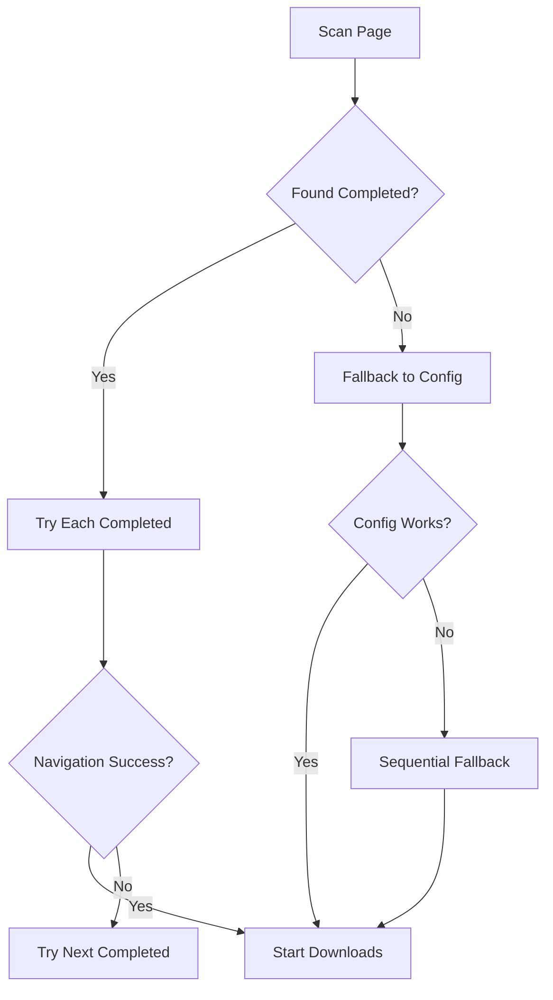

# Queue Detection System Guide

## Overview

The Queue Detection System intelligently filters generation containers on the initial `/generate` page to identify which generations are completed and ready for download, automatically skipping queued or failed generations.

## Key Features

### 🔍 **Intelligent State Detection**
- **Completed Generations**: Ready for download (has thumbnail + content indicators)
- **Queued Generations**: Still processing ("Queuing…", "Processing...", etc.)
- **Failed Generations**: Error states ("Something went wrong", "Generation failed")
- **Unknown States**: Unclear status (treated with caution)

### 🎯 **Smart Navigation**
- Scans all 10 containers on initial `/generate` page
- Automatically selects first available completed generation
- Falls back to configured selector if no completed generations found
- Provides comprehensive logging for debugging

## How It Works

### 1. Page Analysis
The system checks each generation container (`div[id$='__1']` through `div[id$='__10']`) and analyzes:

```python
# Text content analysis
element_text = await element.text_content()

# Queuing indicators (highest priority)
queuing_indicators = [
    "Queuing…",
    "Queuing...", 
    "In queue",
    "Waiting in queue",
    "Processing...",
    "Generating..."
]

# Failed generation patterns
failed_patterns = [
    "Failed to generate", 
    "Generation failed",
    "Error occurred", 
    "Try again later",
    "Generation error",
    "Something went wrong"
]

# Completion indicators
has_thumbnail = await element.query_selector('img, video, .thumbnail') is not None
has_content = any(indicator in element_text for indicator in [
    'Image to video',
    'Creation Time', 
    'Download',
    'Generate',
    'seconds'  # Duration indicator
])
```

### 2. Status Classification

| Status | Criteria | Action |
|--------|----------|---------|
| **queued** | Contains queuing indicators | ⏳ Skip - not ready for download |
| **failed** | Contains failure patterns | ❌ Skip - generation failed |
| **completed** | Has thumbnail OR content indicators | ✅ Available for download |
| **unclear** | No clear indicators | ❓ Treat with caution |

### 3. Navigation Strategy



## Configuration

### Basic Configuration
The queue detection system works automatically without additional configuration. However, you can customize behavior:

```json
{
  "completed_task_selector": "div[id$='__19']",
  "use_intelligent_navigation": true,
  "fallback_to_config": true
}
```

### Advanced Options
```json
{
  "queue_detection_enabled": true,
  "skip_failed_generations": true,
  "max_containers_to_scan": 10,
  "custom_queuing_indicators": ["Custom queuing text"],
  "custom_failure_patterns": ["Custom error text"]
}
```

## Example Scenarios

### Scenario 1: Mixed Page with 8 Queued, 2 Completed
```
Container __1: "Image to video Creation Time 5 seconds" ✅ COMPLETED
Container __2: "Queuing…" ⏳ QUEUED
Container __3: "Queuing…" ⏳ QUEUED  
Container __4: "Processing..." ⏳ QUEUED
Container __5: "Image to video Creation Time 3 seconds" ✅ COMPLETED
Container __6: "Queuing…" ⏳ QUEUED
Container __7: "Queuing…" ⏳ QUEUED
Container __8: "Queuing…" ⏳ QUEUED
Container __9: "Queuing…" ⏳ QUEUED
Container __10: "Something went wrong" ❌ FAILED

Result: Navigates to __1, processes downloads from gallery
```

### Scenario 2: All Generations Queued
```
All containers show "Queuing…" status

Result: Falls back to configured selector or sequential approach
Logs: "⚠️ No completed generations found on initial page!"
```

### Scenario 3: Some Failed, Some Completed
```
Container __1: "Generation failed" ❌ FAILED
Container __2: "Image to video Creation Time 7 seconds" ✅ COMPLETED
Container __3: "Something went wrong" ❌ FAILED
Container __4: "Image to video Creation Time 2 seconds" ✅ COMPLETED

Result: Navigates to __2 (first completed generation)
```

## Logging and Debugging

### Log Levels
- **INFO**: Generation status detection results
- **WARNING**: Failed or unclear generations
- **DEBUG**: Detailed analysis of each container

### Sample Log Output
```
🔍 Scanning initial /generate page for completed generations...
✅ Found completed generation: __1
⏳ Skipping queued generation: __2  
⏳ Skipping queued generation: __3
❌ Skipping failed generation: __4
✅ Found completed generation: __5
📊 Found 2 completed generations out of 10 checked
🎯 Found 2 completed generations, trying to navigate...
🔄 Attempting to navigate using completed generation: div[id$='__1']
🎉 Successfully navigated to gallery using div[id$='__1']
```

## Testing

### Run Queue Detection Tests
```bash
python3.11 tests/test_queue_detection.py
```

### Test Scenarios Covered
- ✅ Queued generation detection
- ✅ Completed generation detection  
- ✅ Failed generation detection
- ✅ Mixed page scenario (4 completed out of 10)

### Test Results
```
📋 Test Results Summary:
   ✅ Queued generation detection
   ✅ Completed generation detection
   ✅ Failed generation detection
   ✅ Mixed page scenario detection

🎯 Key Benefits:
   • Skips 'Queuing…' generations automatically
   • Identifies only completed generations for processing
   • Handles failed generations gracefully
   • Processes up to 4 completed generations from initial page
```

## Troubleshooting

### Issue: No Completed Generations Detected
**Symptoms**: Logs show "No completed generations found on initial page"

**Solutions**:
1. Check if page has loaded properly
2. Verify generation containers are present
3. Update selector patterns if page structure changed
4. Enable debug logging for detailed analysis

### Issue: False Positives (Queued Marked as Completed)
**Symptoms**: Automation attempts to process queued generations

**Solutions**:
1. Add custom queuing indicators to configuration
2. Check for new queuing text patterns on page
3. Update `queuing_indicators` list in code

### Issue: Navigation Fails After Detection
**Symptoms**: Completed generations detected but navigation fails

**Solutions**:
1. Verify thumbnail selectors are correct
2. Check if page structure has changed
3. Increase navigation timeouts
4. Use configured selector as fallback

## Integration with Existing Systems

### Duplicate Detection
The queue detection system works seamlessly with duplicate detection:
- First finds completed generations
- Then checks each for duplicates during processing
- Skips duplicates and continues with next completed generation

### Start-From Navigation  
Compatible with start-from-thumbnail functionality:
- Queue detection finds entry point to gallery
- Start-from navigation positions within gallery
- Both systems work together for precise positioning

### Infinite Scroll
Enhances infinite scroll by providing clean starting point:
- Starts from known completed generation
- Ensures gallery content is available before scrolling
- Provides consistent behavior across different page states

## Performance Impact

### Minimal Overhead
- Scans 10 containers in ~200ms
- Text analysis is lightweight
- Caches results during navigation attempts
- No significant impact on overall automation speed

### Benefits
- **Reduced Errors**: Eliminates attempts to process queued generations
- **Faster Startup**: Finds optimal entry point immediately  
- **Better Reliability**: Handles page state variations gracefully
- **Improved Logging**: Clear visibility into generation states

---

*Last Updated: August 28, 2024*  
*Compatible with: Automaton v2.0+*