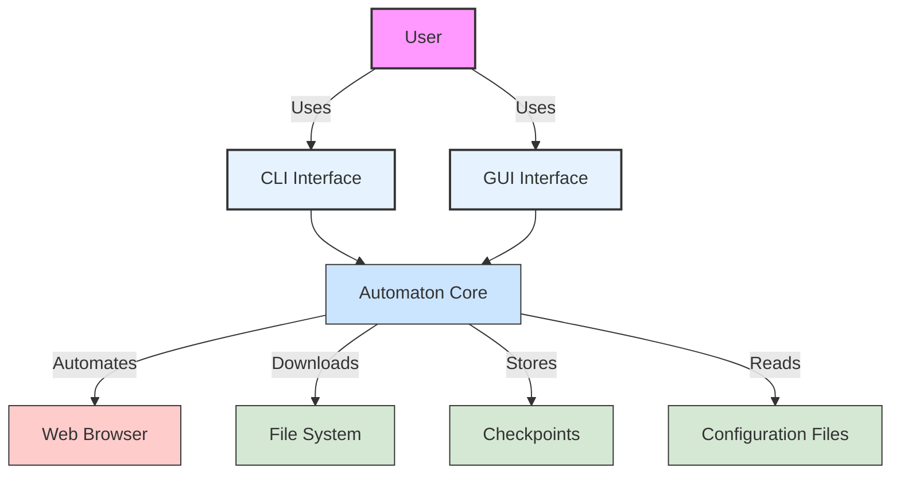
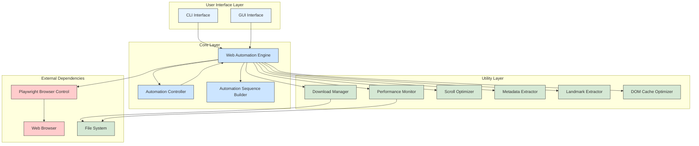
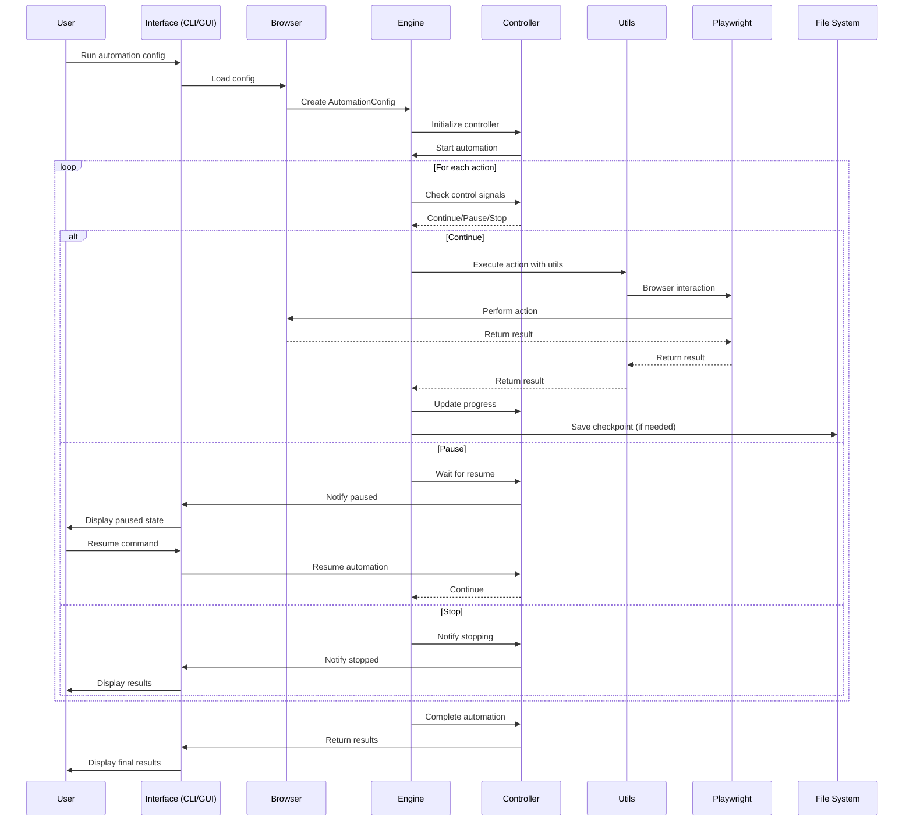
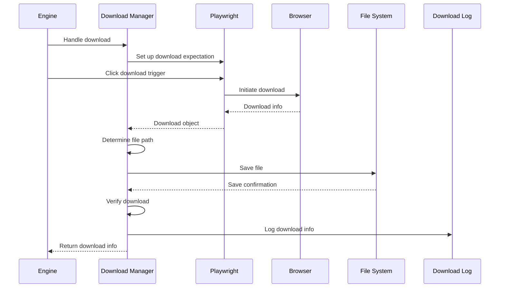
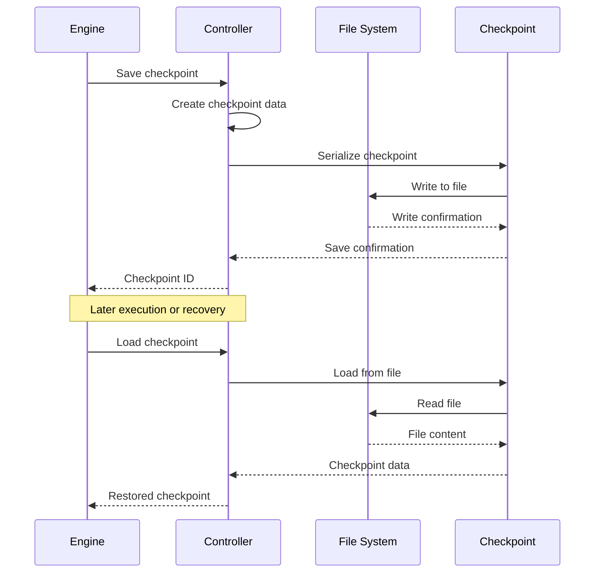
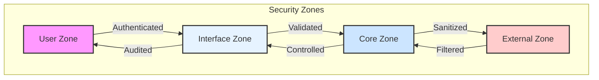
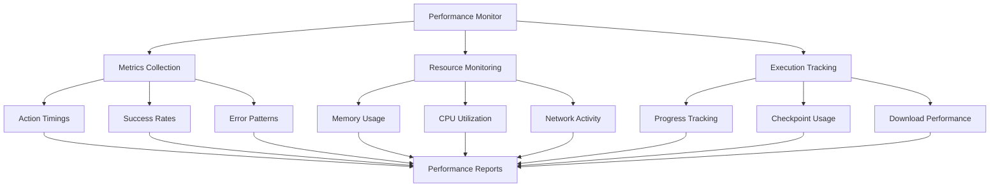
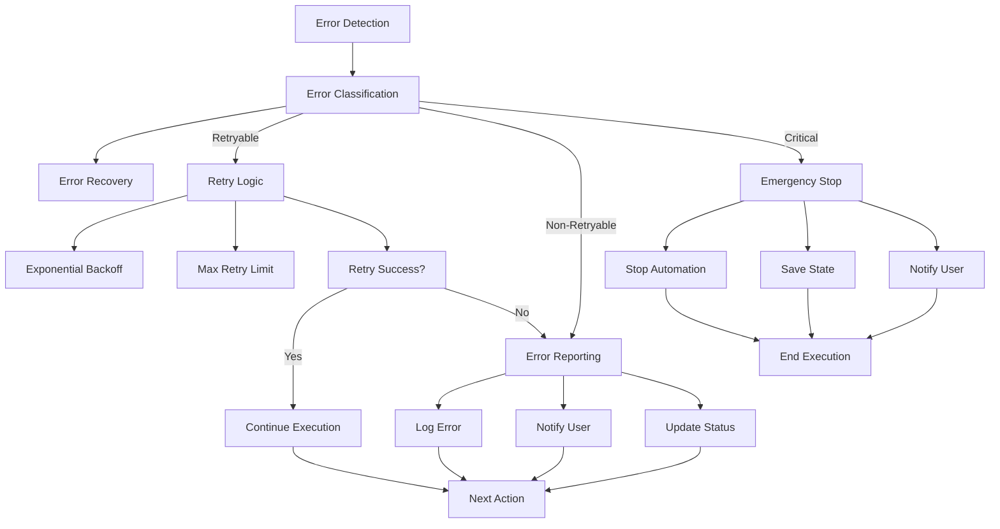
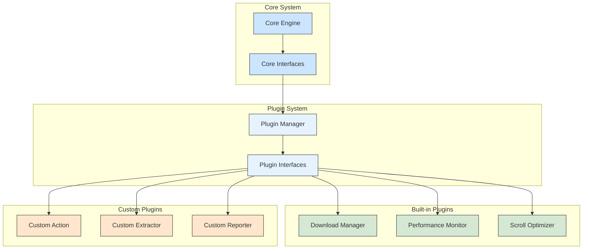
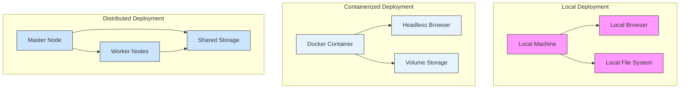

# Automaton System Architecture Design

## Executive Summary

This document outlines the system architecture for Automaton, a web automation framework designed to provide robust, scalable, and secure automation capabilities. The architecture follows a layered approach with clear separation of concerns, modular components, and well-defined interfaces.

## 1. Architectural Approach

The Automaton system employs a **layered architecture** with elements of **event-driven control** and **modular component design**. This approach provides:

- Clear separation between automation logic, control mechanisms, and utility functions
- Extensibility through well-defined interfaces and plugin architecture
- Resilience through proper error handling and state management
- Observability through comprehensive logging and monitoring
- Security through input validation and proper access controls

## 2. System Context



### 2.1 External Entities

- **User**: Interacts with the system through CLI or GUI interfaces
- **Web Browser**: Target for automation actions (Chrome, Firefox, etc.)
- **File System**: Stores downloaded files, logs, and checkpoints
- **Configuration Files**: JSON/YAML files defining automation sequences

## 3. Container Architecture



## 4. Component Architecture

### 4.1 Core Components

#### 4.1.1 Web Automation Engine
**Responsibilities:**
- Execute automation sequences
- Manage browser lifecycle
- Handle action execution and error recovery
- Coordinate with utility components

**Key Interfaces:**
```python
class WebAutomationEngine:
    async def initialize() -> None
    async def navigate_to_url() -> None
    async def execute_action(action: Action) -> Dict[str, Any]
    async def run_automation() -> Dict[str, Any]
    async def cleanup() -> None
```

#### 4.1.2 Automation Controller
**Responsibilities:**
- Manage automation lifecycle (start, pause, resume, stop)
- Handle checkpoint creation and restoration
- Track progress and state
- Provide control signals to engine

**Key Interfaces:**
```python
class AutomationController:
    def start_automation(total_actions: int) -> bool
    def pause_automation() -> bool
    def resume_automation() -> bool
    def stop_automation(emergency: bool) -> bool
    def save_checkpoint(...) -> str
    def load_checkpoint(checkpoint_id: str) -> AutomationCheckpoint
```

#### 4.1.3 Automation Sequence Builder
**Responsibilities:**
- Provide fluent API for building automation sequences
- Validate configuration
- Serialize/deserialize automation configs

**Key Interfaces:**
```python
class AutomationSequenceBuilder:
    def add_click_button(selector: str, description: str) -> AutomationSequenceBuilder
    def add_input_text(selector: str, text: str, description: str) -> AutomationSequenceBuilder
    def add_wait(milliseconds: int, description: str) -> AutomationSequenceBuilder
    def build() -> AutomationConfig
    def save_to_file(file_path: str) -> None
```

### 4.2 Utility Components

#### 4.2.1 Download Manager
**Responsibilities:**
- Handle file downloads from web pages
- Organize downloaded files
- Verify download integrity
- Log download activities

**Key Interfaces:**
```python
class DownloadManager:
    async def handle_playwright_download(...) -> DownloadInfo
    async def handle_direct_download(...) -> DownloadInfo
    def get_download_path(filename: str, mime_type: str) -> Path
    async def wait_for_download_completion(...) -> bool
```

#### 4.2.2 Performance Monitor
**Responsibilities:**
- Track execution metrics
- Monitor resource usage
- Generate performance reports
- Identify optimization opportunities

**Key Interfaces:**
```python
class PerformanceMonitor:
    def start_timer(action_name: str) -> None
    def stop_timer(action_name: str) -> None
    def log_metric(metric_name: str, value: float) -> None
    def get_summary() -> Dict[str, Any]
```

#### 4.2.3 Scroll Optimizer
**Responsibilities:**
- Optimize page scrolling behavior
- Handle infinite scroll detection
- Manage scroll position and visibility
- Implement boundary detection

**Key Interfaces:**
```python
class ScrollOptimizer:
    async def scroll_to_element(element) -> None
    async def scroll_page(direction: str, amount: int) -> None
    def detect_infinite_scroll() -> bool
    def get_scroll_position() -> Dict[str, int]
```

#### 4.2.4 Metadata Extractor
**Responsibilities:**
- Extract metadata from web elements
- Parse structured data
- Handle content validation
- Support multiple extraction strategies

**Key Interfaces:**
```python
class MetadataExtractor:
    async def extract_text(element) -> str
    async def extract_attributes(element, attributes: List[str]) -> Dict[str, str]
    async def extract_structured_data(schema: str) -> Dict[str, Any]
    def validate_extraction(data: Any, schema: str) -> bool
```

#### 4.2.5 Landmark Extractor
**Responsibilities:**
- Identify visual landmarks on pages
- Support navigation between landmarks
- Handle landmark-based positioning
- Cache landmark information

**Key Interfaces:**
```python
class LandmarkExtractor:
    async def extract_landmarks(page) -> List[Landmark]
    async def navigate_to_landmark(landmark_id: str) -> bool
    async def find_nearest_landmark(element) -> Landmark
    def get_landmark_cache() -> Dict[str, Landmark]
```

#### 4.2.6 DOM Cache Optimizer
**Responsibilities:**
- Cache DOM queries and results
- Optimize element selection
- Manage cache invalidation
- Improve performance of repeated queries

**Key Interfaces:**
```python
class DOMCacheOptimizer:
    async def query_selector_cached(selector: str) -> Element
    def invalidate_cache(pattern: str) -> None
    def get_cache_stats() -> Dict[str, Any]
    def optimize_selector(selector: str) -> str
```

## 5. Data Flow Architecture

### 5.1 Automation Execution Flow



### 5.2 Download Management Flow



### 5.3 Checkpoint Management Flow



## 6. Interface Contracts

### 6.1 Action Execution Contract

```typescript
interface Action {
  type: ActionType;
  selector?: string;
  value?: any;
  timeout?: number;
  description?: string;
}

interface ActionResult {
  success: boolean;
  data?: any;
  error?: string;
  executionTime: number;
}
```

### 6.2 Control Signal Contract

```typescript
enum ControlSignal {
  PAUSE = "pause",
  RESUME = "resume",
  STOP = "stop",
  EMERGENCY_STOP = "emergency_stop"
}

interface ControlSignalResponse {
  signal: ControlSignal;
  handled: boolean;
  state: AutomationState;
}
```

### 6.3 Download Management Contract

```typescript
interface DownloadConfig {
  base_download_path: string;
  organize_by_date: boolean;
  organize_by_type: boolean;
  max_wait_time: number;
  check_interval: number;
  auto_rename_duplicates: boolean;
  verify_downloads: boolean;
  create_download_log: boolean;
}

interface DownloadInfo {
  filename: string;
  original_filename: string;
  file_path: string;
  file_size: number;
  download_time: Date;
  source_url: string;
  mime_type?: string;
  checksum?: string;
  status: "pending" | "downloading" | "completed" | "failed";
}
```

## 7. Security Architecture

### 7.1 Security Boundaries



### 7.2 Security Measures

1. **Input Validation**
   - All user inputs sanitized before processing
   - CSS selectors validated to prevent injection
   - File paths validated to prevent directory traversal

2. **Access Control**
   - File system access restricted to designated directories
   - Browser operations limited to configured domains
   - Checkpoint access controlled by ownership

3. **Data Protection**
   - Sensitive data encrypted in checkpoints
   - Credentials managed through secure credential manager
   - Download integrity verified through checksums

4. **Audit Trail**
   - All automation actions logged
   - Control signals recorded with timestamps
   - Download activities tracked with metadata

## 8. Performance Architecture

### 8.1 Performance Optimization Strategies

1. **Caching Layers**
   - DOM query results cached
   - Element positions cached
   - Page metadata cached
   - Download paths cached

2. **Resource Management**
   - Browser instances pooled
   - Memory usage monitored
   - Concurrent actions limited
   - File handles managed efficiently

3. **Execution Optimization**
   - Parallel actions where possible
   - Smart waiting strategies
   - Adaptive timeouts
   - Selective element loading

### 8.2 Performance Monitoring



## 9. Error Handling and Resilience

### 9.1 Error Handling Strategy



### 9.2 Resilience Patterns

1. **Retry with Exponential Backoff**
   - For transient network errors
   - For temporary element unavailability
   - For intermittent browser issues

2. **Circuit Breaker**
   - For repeated failures
   - For external service unavailability
   - For resource exhaustion

3. **Checkpoint and Recovery**
   - For long-running automations
   - For unexpected interruptions
   - For debugging and analysis

4. **Graceful Degradation**
   - For non-critical feature failures
   - For performance constraints
   - For partial data availability

## 10. Extensibility Architecture

### 10.1 Plugin Architecture



### 10.2 Extension Points

1. **Custom Actions**
   - Define new action types
   - Implement custom execution logic
   - Integrate with control system

2. **Custom Extractors**
   - Implement domain-specific data extraction
   - Handle specialized content formats
   - Integrate with metadata system

3. **Custom Reporters**
   - Generate specialized reports
   - Integrate with external systems
   - Support custom formats

4. **Custom Validators**
   - Implement domain-specific validation
   - Handle complex business rules
   - Integrate with action system

## 11. Deployment Architecture

### 11.1 Deployment Models



### 11.2 Configuration Management

1. **Environment Configuration**
   - Browser settings
   - Performance thresholds
   - Security policies
   - Logging levels

2. **Runtime Configuration**
   - Automation sequences
   - Action parameters
   - Control settings
   - Checkpoint policies

3. **Deployment Configuration**
   - Resource allocation
   - Scaling policies
   - Network settings
   - Storage configuration

## 12. Architectural Decisions and Rationale

### 12.1 Layered Architecture

**Decision**: Use a layered architecture with clear separation between interfaces, core, and utility components.

**Rationale**:
- Provides clear boundaries between concerns
- Enables independent development and testing of components
- Facilitates future extensibility and maintenance
- Supports multiple interface types (CLI, GUI)

**Alternatives Considered**:
- Monolithic architecture: Rejected due to lack of flexibility and maintainability
- Microservices architecture: Rejected due to complexity overhead for this application scope

### 12.2 Event-Driven Control

**Decision**: Implement event-driven control for automation lifecycle management.

**Rationale**:
- Enables responsive control of automation execution
- Supports complex control flows (pause, resume, stop)
- Facilitates integration with external monitoring systems
- Provides better user experience for long-running automations

**Alternatives Considered**:
- Polling-based control: Rejected due to inefficiency and delayed response
- Thread-based control: Rejected due to complexity and potential race conditions

### 12.3 Plugin Architecture

**Decision**: Design utility components as plugins with well-defined interfaces.

**Rationale**:
- Enables modular development and testing
- Supports custom extensions without core modifications
- Facilitates selective loading of components based on needs
- Provides clear separation between core and extended functionality

**Alternatives Considered**:
- Static integration: Rejected due to lack of flexibility and increased coupling
- Dynamic loading without interfaces: Rejected due to lack of structure and maintainability

### 12.4 Checkpoint-Based Recovery

**Decision**: Implement checkpoint-based recovery for automation state management.

**Rationale**:
- Enables recovery from interruptions
- Supports debugging and analysis of automation failures
- Facilitates long-running automation scenarios
- Provides audit trail for automation execution

**Alternatives Considered**:
- Full state serialization: Rejected due to performance overhead and complexity
- Log-based replay: Rejected due to potential for non-deterministic behavior

### 12.5 Utility Component Specialization

**Decision**: Create specialized utility components for specific domains (downloads, performance, etc.).

**Rationale**:
- Enables focused expertise in each utility domain
- Supports independent optimization and enhancement
- Facilitates clear responsibility boundaries
- Provides better testability and maintainability

**Alternatives Considered**:
- General-purpose utility framework: Rejected due to lack of specialization and increased complexity
- Integrated utilities: Rejected due to coupling and lack of clear boundaries

## 13. Glossary

| Term | Definition |
|------|------------|
| Action | A single operation in an automation sequence (e.g., click, input text) |
| Automation Sequence | A series of actions that define an automation workflow |
| Checkpoint | A saved state of automation execution that can be restored |
| Control Signal | A command to control automation execution (pause, resume, stop) |
| Extractor | A component that extracts data from web elements |
| Landmark | A visually distinctive element on a web page used for navigation |
| Playwright | A browser automation library used for web interaction |
| Plugin | An extensible component that adds functionality to the core system |
| Selector | A string that identifies elements on a web page (e.g., CSS selector) |
| Utility Component | A specialized component that provides specific functionality to the system |