# Automaton Component Diagrams and Integration Points

## 1. Component Overview Diagram

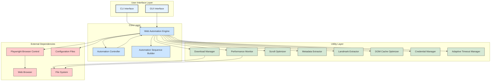

## 2. Core Component Integration

### 2.1 Web Automation Engine Integration

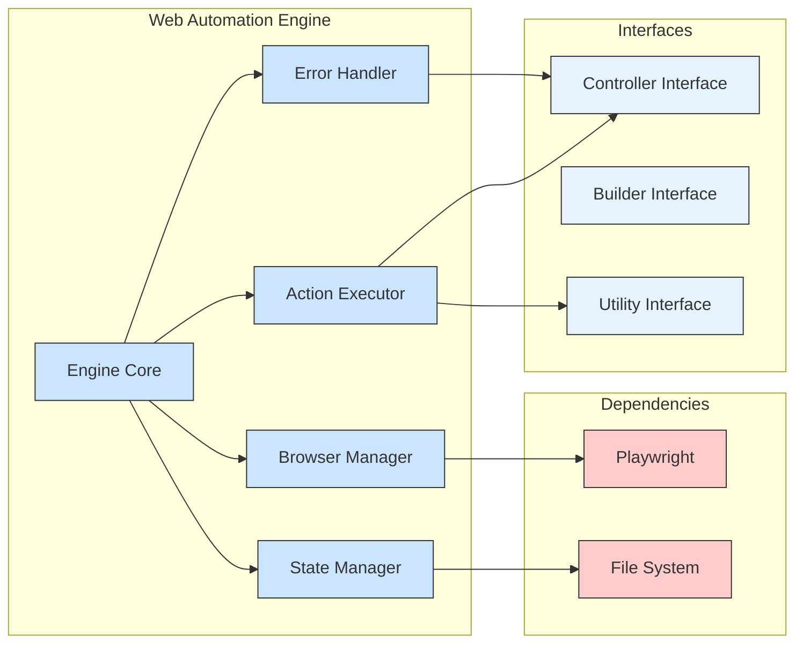

### 2.2 Automation Controller Integration

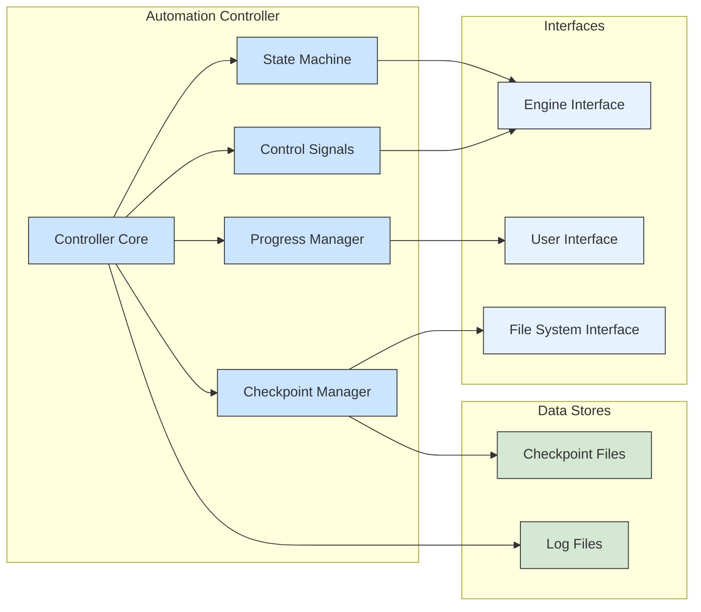

### 2.3 Automation Sequence Builder Integration

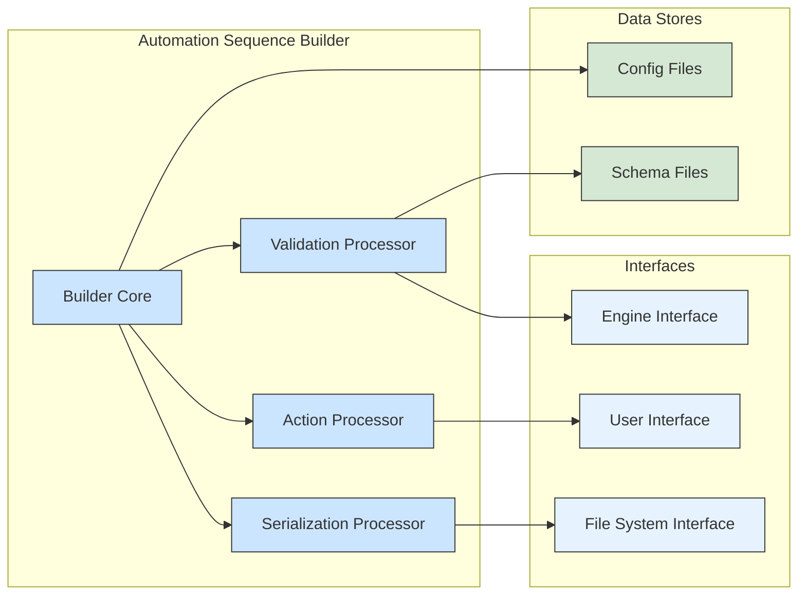

## 3. Utility Component Integration

### 3.1 Download Manager Integration

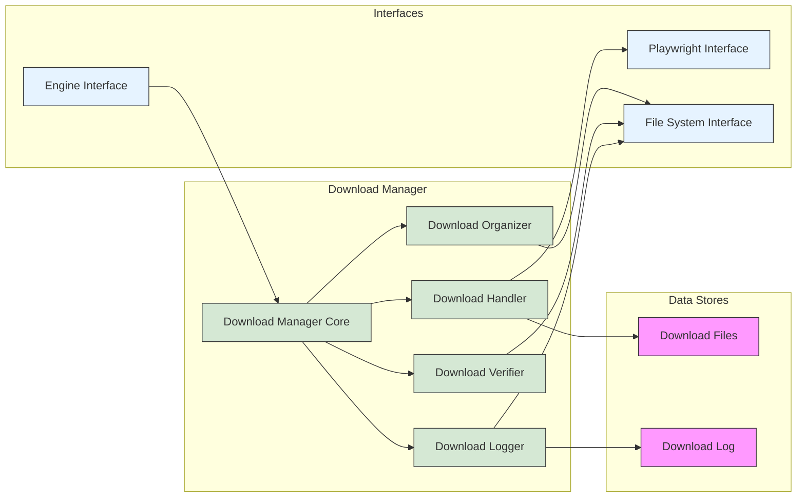

### 3.2 Performance Monitor Integration

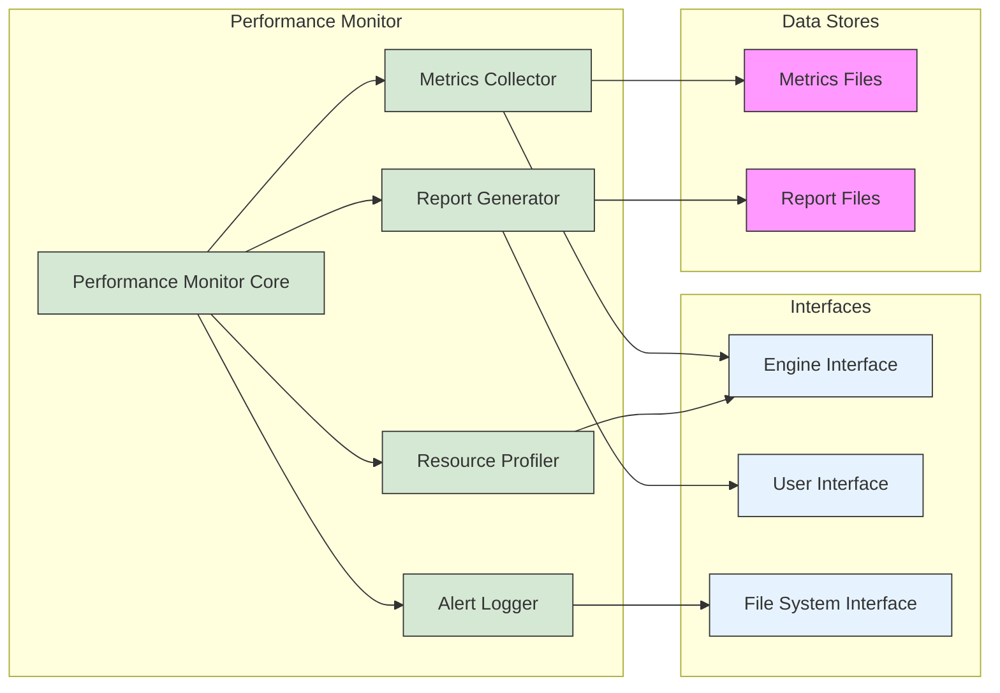

### 3.3 Metadata Extractor Integration

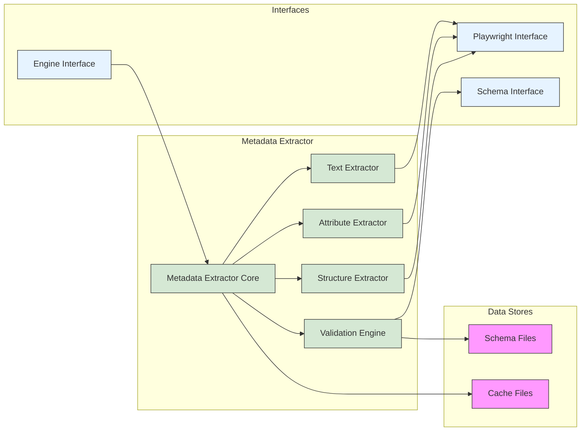

## 4. Data Flow Diagrams

### 4.1 Automation Execution Data Flow

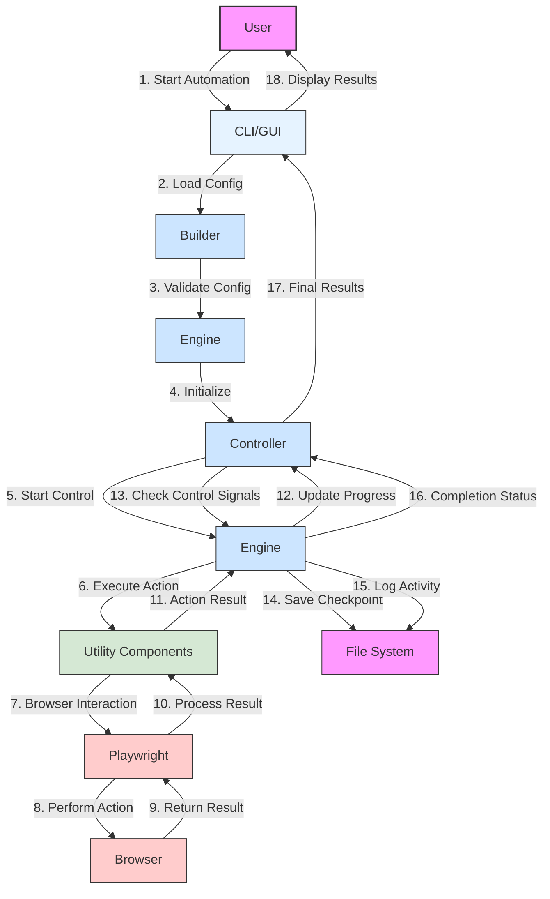

### 4.2 Download Management Data Flow

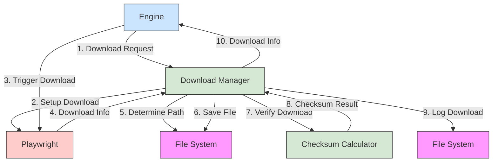

### 4.3 Checkpoint Management Data Flow

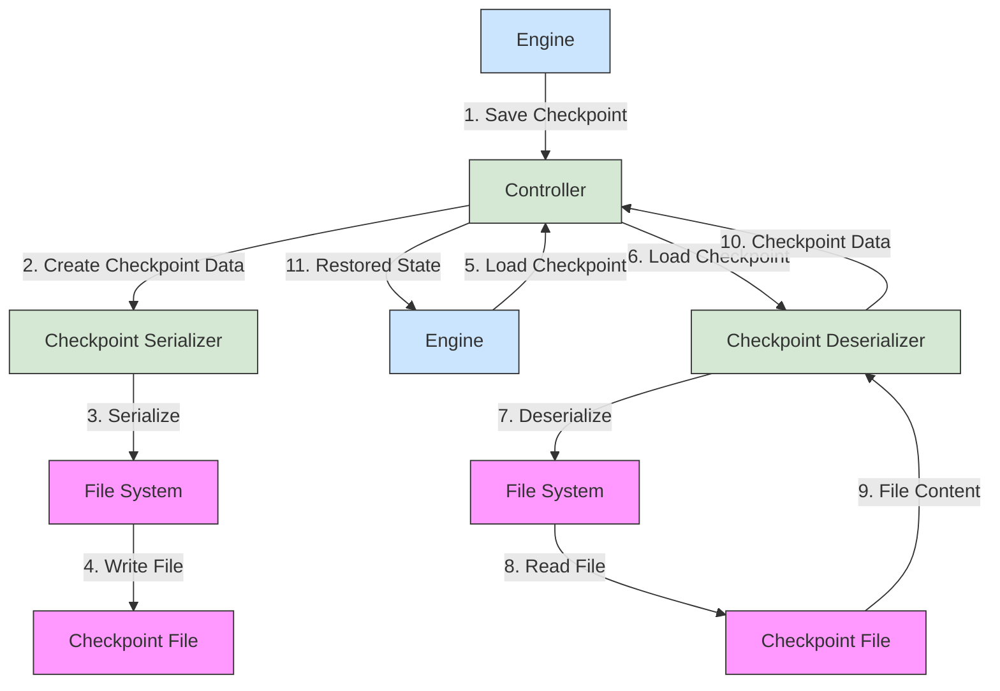

## 5. Interface Contracts

### 5.1 Core-Utility Interface

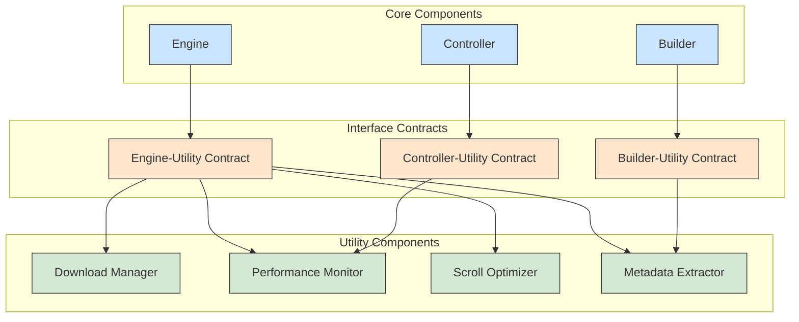

### 5.2 External Interface

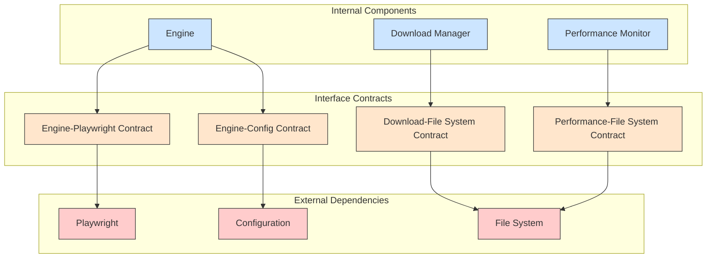

## 6. Security Boundaries

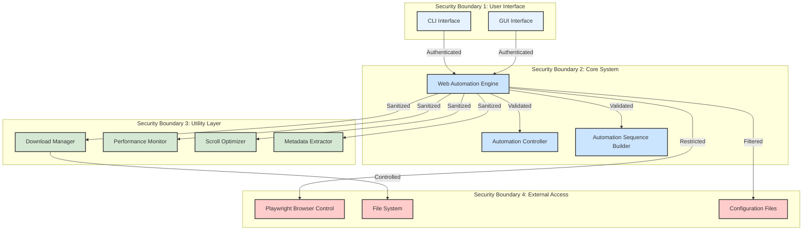

## 7. Error Handling Flow

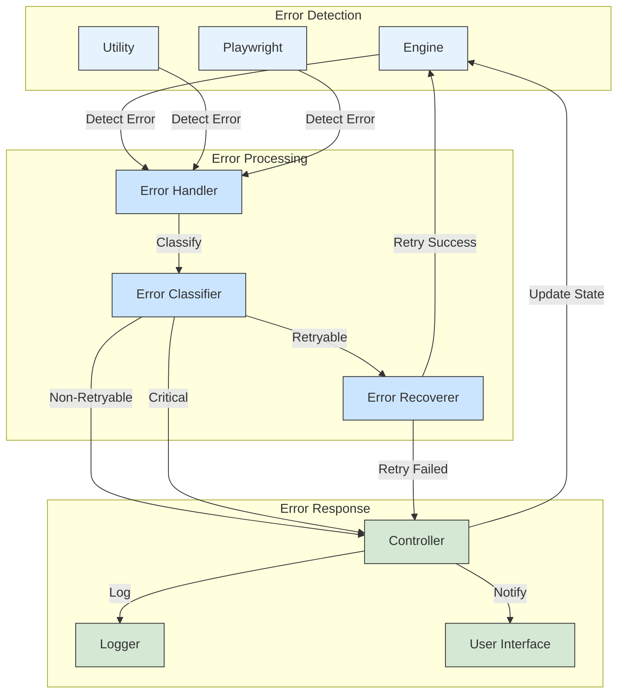

## 8. Performance Optimization Flow

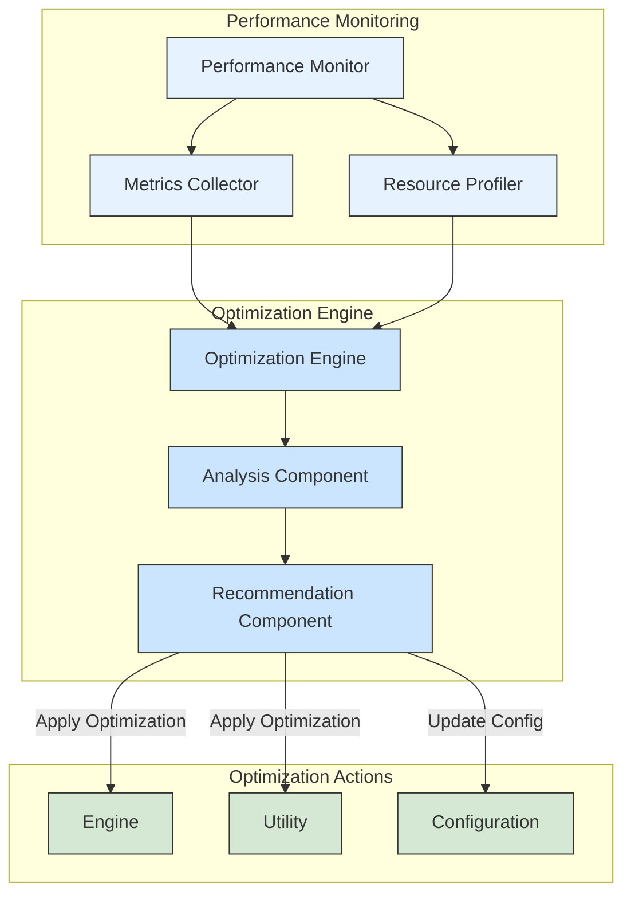

## 9. Extension Points

```mermaid
graph TD
    subgraph "Core System"
        CS[Core System]
        PI[Plugin Interface]
    end
    
    subgraph "Built-in Plugins"
        BP1[Download Manager]
        BP2[Performance Monitor]
        BP3[Scroll Optimizer]
    end
    
    subgraph "Extension Points"
        EP1[Custom Action Extension]
        EP2[Custom Extractor Extension]
        EP3[Custom Reporter Extension]
    end
    
    subgraph "Custom Plugins"
        CP1[Custom Action Plugin]
        CP2[Custom Extractor Plugin]
        CP3[Custom Reporter Plugin]
    end
    
    CS --> PI
    PI --> BP1
    PI --> BP2
    PI --> BP3
    
    PI --> EP1
    PI --> EP2
    PI --> EP3
    
    EP1 --> CP1
    EP2 --> CP2
    EP3 --> CP3
    
    classDef core fill:#cce5ff,stroke:#333,stroke-width:1px
    classDef builtin fill:#d5e8d4,stroke:#333,stroke-width:1px
    classDef extension fill:#ffe6cc,stroke:#333,stroke-width:1px
    classDef custom fill:#ffcccc,stroke:#333,stroke-width:1px
    
    class CS,PI core
    class BP1,BP2,BP3 builtin
    class EP1,EP2,EP3 extension
    class CP1,CP2,CP3 custom