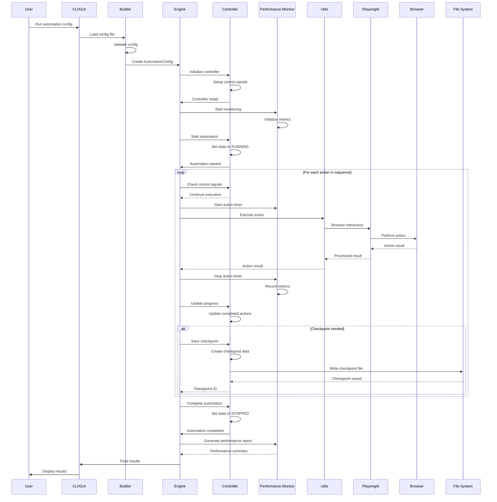
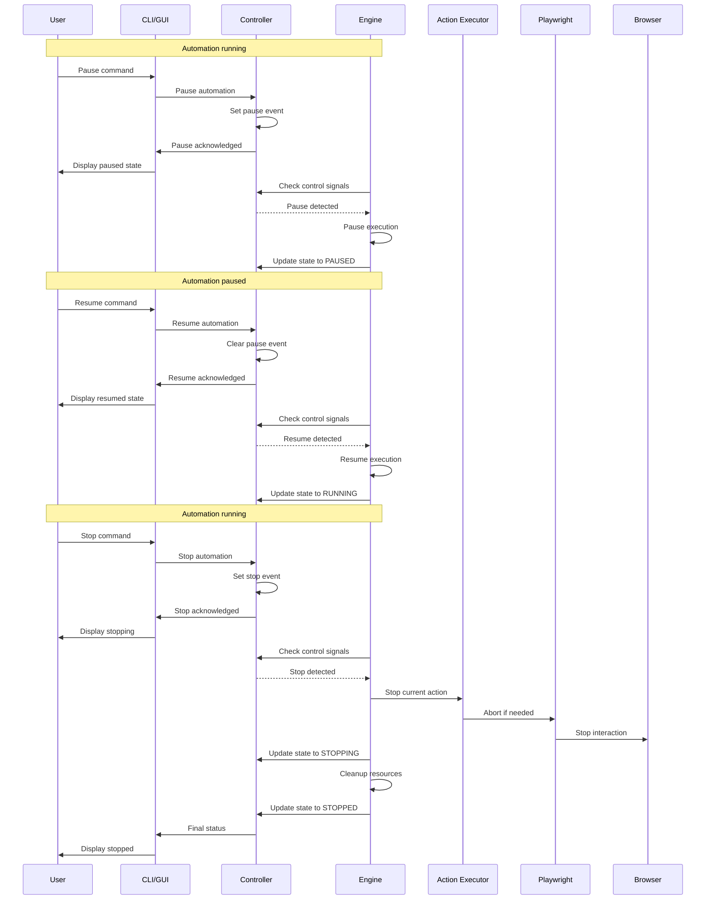
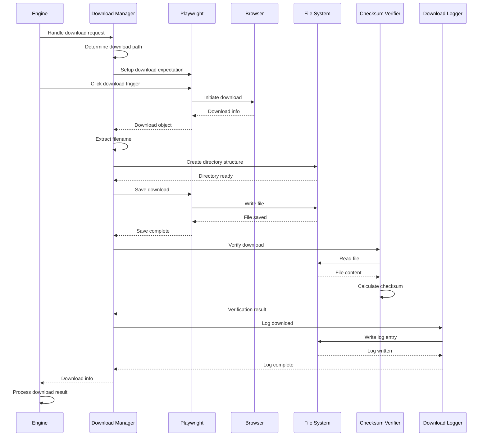
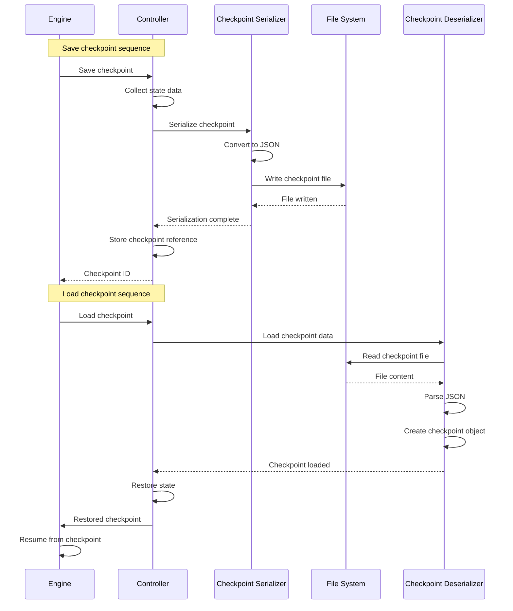
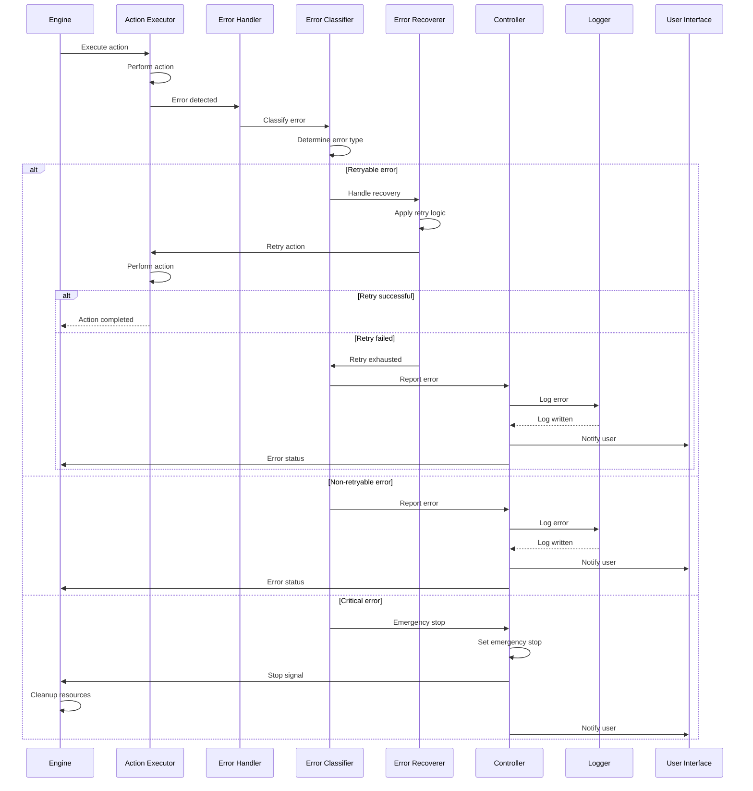
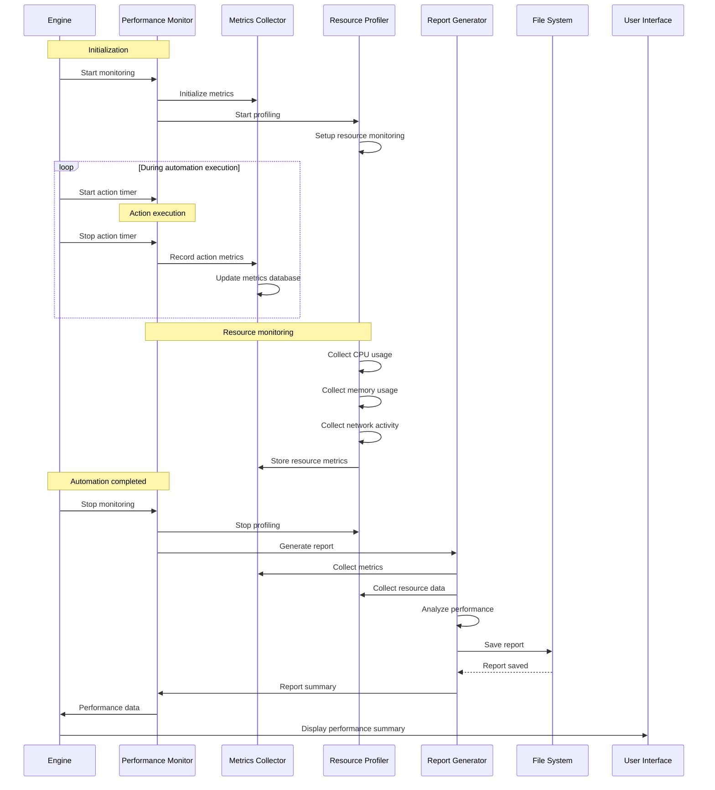
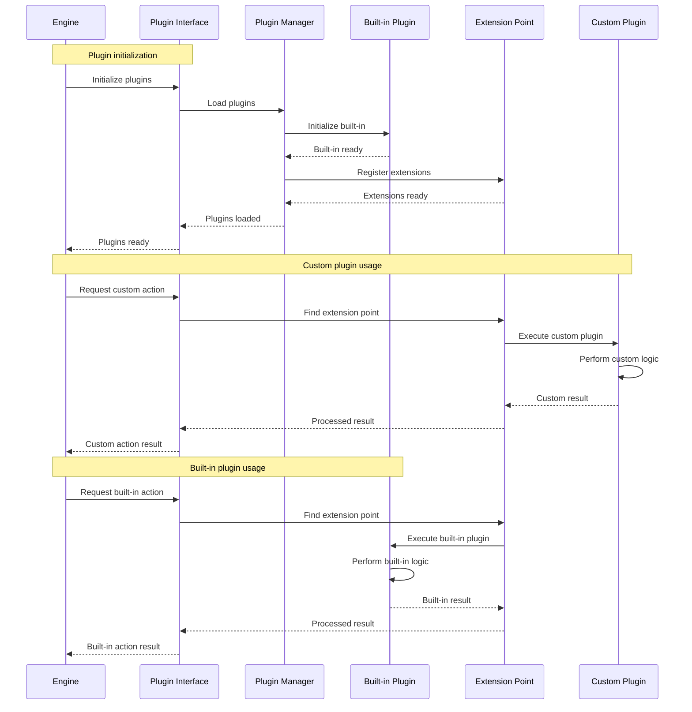
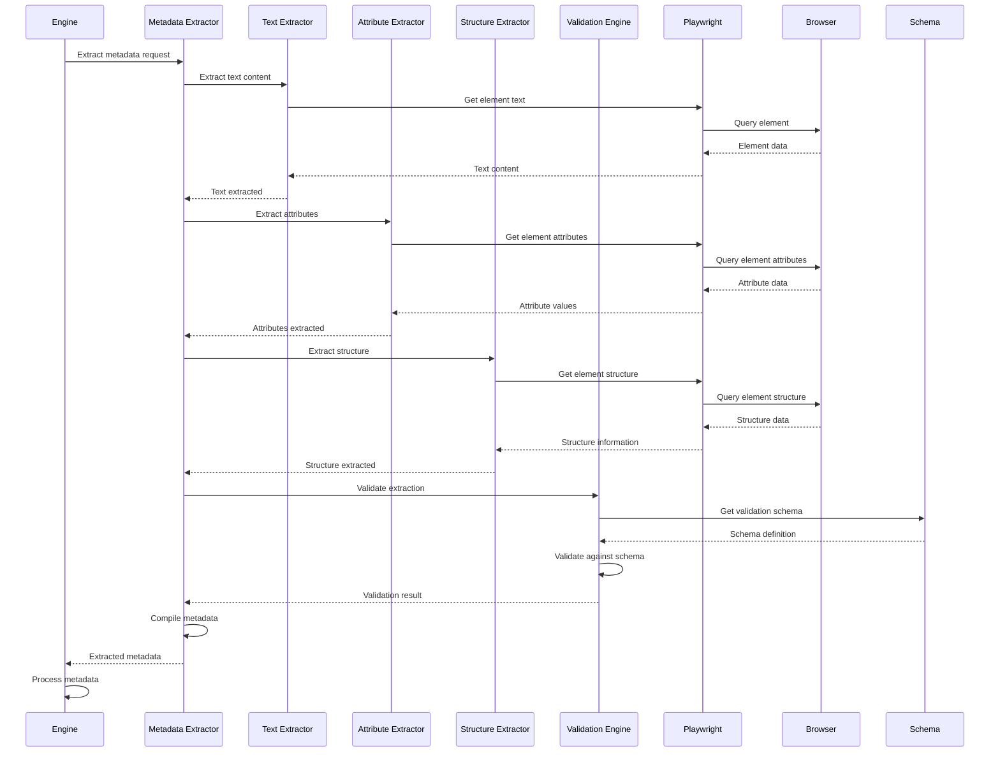
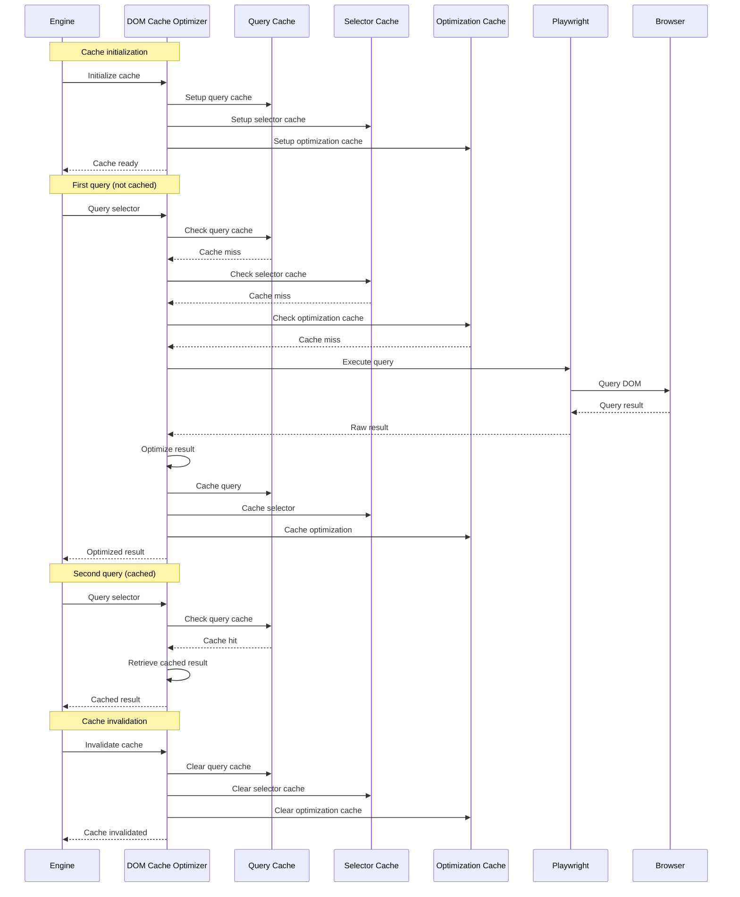

# Automaton Sequence Diagrams

## 1. Automation Execution Sequence



## 2. Control Signal Handling Sequence



## 3. Download Management Sequence



## 4. Checkpoint Management Sequence



## 5. Error Handling Sequence



## 6. Performance Monitoring Sequence



## 7. Plugin Extension Sequence



## 8. Metadata Extraction Sequence



## 9. DOM Cache Optimization Sequence



## 10. Adaptive Timeout Management Sequence

```mermaid
sequenceDiagram
    participant E as Engine
    participant AT as Adaptive Timeout Manager
    participant TC as Timeout Calculator
    participant HM as History Manager
    participant AM as Adjustment Manager
    participant P as Playwright
    participant BR as Browser

    Note over E,AT: Timeout initialization
    E->>AT: Initialize timeout management
    AT->>HM: Load timeout history
    AT->>TC: Set initial timeout values
    AT-->>E: Timeout manager ready
    
    Note over E,AT: Action execution with timeout
    E->>AT: Start action with timeout
    AT->>TC: Calculate timeout
    TC->>HM: Get historical data
    HM-->>TC: Timeout history
    TC->>TC: Compute optimal timeout
    TC-->>AT: Timeout value
    AT->>E: Timeout value
    E->>P: Execute action with timeout
    P->>BR: Perform action
    
    alt Action completes within timeout
        BR-->>P: Action result
        P-->>E: Action completed
        E->>AT: Action completed
        AT->>HM: Record successful timeout
        AT->>AM: Analyze performance
        AM->>AM: Adjust timeout strategy
    else Action times out
        P-->>E: Timeout exceeded
        E->>AT: Timeout occurred
        AT->>HM: Record timeout failure
        AT->>AM: Analyze failure
        AM->>AM: Adjust timeout strategy
        AT->>E: Timeout handling result
    end
    
    Note over E,AT: Periodic optimization
    E->>AT: Optimize timeout settings
    AT->>HM: Get timeout history
    HM-->>AT: Complete history
    AT->>AM: Analyze patterns
    AM->>AM: Calculate optimal settings
    AM->>TC: Update timeout calculations
    TC-->>AT: Calculations updated
    AT-->>E: Optimization complete